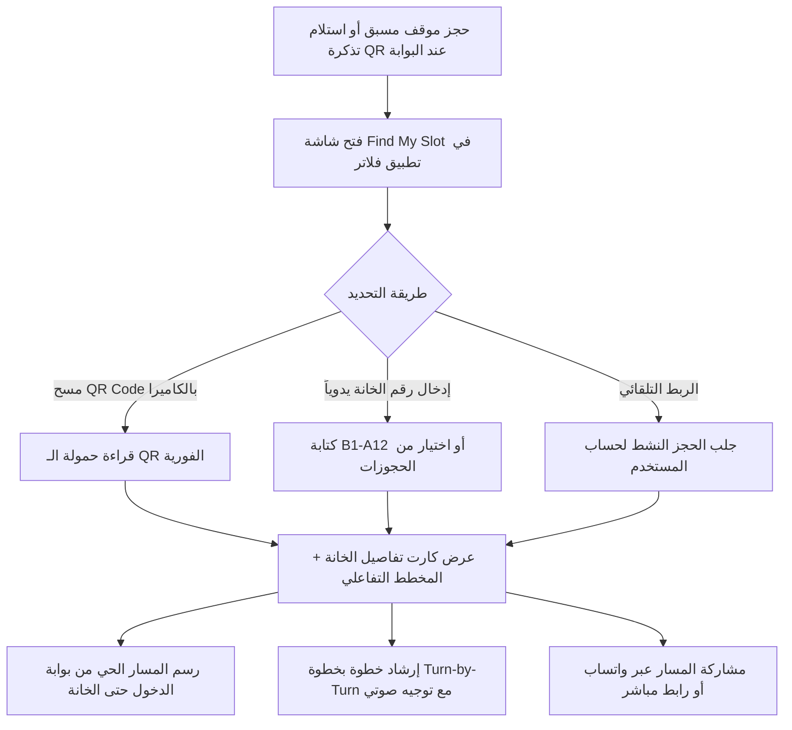

# 🚗 دليل التطوير والتكامل لمطوّر فلاتر: ميزة "تحديد مسار خانتي المحجوزة" (Find My Slot)
### NRI Parking Ecosystem • Next-Gen Smart Guidance & Slot Navigation Specification

---

## 📌 1. نظرة عامة على الميزة (Feature Overview)

تم تصميم ميزة **"الملاحة إلى خانتي المحجوزة" (Find My Slot)** لتمكين قائد المركبة — بمجرد إتمام حجز موقف مسبق أو استلام تذكرة الدخول عبر رمز QR عند بوابة الدخول — من معرفة **مكان خانته المحددة بدقة متناهية** وتوجيهه إليها عبر مسار ملاحة داخلي تفاعلي (Turn-by-Turn Guidance) ومخطط طوابق ثلاثي الأبعاد/متجهي، مما يمنع ضياع السائق داخل المواقف المتعددة الأدوار ويقضي على التكدس والبحث العشوائي.



---

## 📱 2. رحلة المستخدم في تطبيق الهاتف (User Flow)

1. **الخطوة الأولى: فتح الميزة:**
   - من الشاشة الرئيسية لتطبيق فلاتر أو من شاشة الحجز/البطاقة الرقمية، يضغط المستخدم على أيقونة **"الملاحة إلى خانتي" (Find My Slot)**.
2. **الخطوة الثانية: التعرف على الخانة:**
   - **تلقائياً:** إذا كان لدى المستخدم حجز نشط، تفتح الشاشة فوراً على خانته المحددة (مثال: `B1-A12`).
   - **عبر المسح:** زر عائم يفتح ماسح الكاميرا (`mobile_scanner`) لمسح الـ QR المطبوع على التذكرة الورقية أو شاشة الكشك.
   - **يدوياً:** حقل بحث سريع لكتابة رقم الخانة مباشرة.
3. **الخطوة الثالثة: شاشة الإرشاد والمخطط:**
   - **كارت مواصفات الخانة:** (رقم الخانة، الطابق، المنطقة، المسافة بالأمتار، زمن القيادة التقديري، تجهيزات الخانة، ومؤقت صلاحية الحجز).
   - **الخريطة التفاعلية (2D/3D Floor Blueprint):** مخطط رقمي للطابق يوضح مسارات السير، خانات المواقف، ومسار متوهج نابض بالأخضر ينطلق من بوابة الدخول ويستقر عند الخانة.
   - **قائمة الإرشادات خطوة بخطوة:** خطوات تفصيلية باللغة العربية الفصحى مع أيقونات اتجاهية واضحة ومسافات دقيقة.
4. **الخطوة الرابعة: الملاحة التفاعلية (Simulation / Turn-by-Turn):**
   - زر "بدء الملاحة" لمتابعة تقدم المركبة على الخريطة مع إمكانية قراءة التوجيهات صوتياً عبر ميزة Text-To-Speech.

---

## 🔍 3. بنية حمولة رمز الاستجابة السريعة (QR Code Specifications)

يدعم النظام نوعين من حمولات الـ QR لضمان التوافق مع التذاكر المطبوعة والروابط العميقة (Deep Links):

### أ) صيغة الرابط العميق المباشر (Deep Link URI):
```text
nri-parking://find-slot?slot=B1-A12&floor=B1&gate=G1&resId=RES-90412
```
*عند مسح هذا الرابط بكاميرا الهاتف العادية أو داخل التطبيق، يقوم نظام توجيه فلاتر (GoRouter أو Navigator) بفتح شاشة الملاحة للخانة المحددة مباشرة.*

### ب) صيغة حمولة الـ JSON المشفرة (Payload):
```json
{
  "protocol": "NRI-SLOT-GUIDANCE",
  "version": "1.0",
  "slotNumber": "B1-A12",
  "floor": "B1",
  "zone": "North-A",
  "gateId": "GATE-01",
  "gateNameAr": "البوابة الشمالية 1 (المدخل الرئيسي)",
  "reservationId": "RES-90412",
  "vehiclePlate": "أ ب ج 1004",
  "expiresAt": "2026-10-01T16:00:00Z"
}
```

---

## 🌐 4. عقود واجهات برمجة التطبيقات (API Endpoints & Contracts)

### 1) جلب تفاصيل ومسار الخانة (Get Slot Guidance & Route)
- **Endpoint:** `GET /api/v1/slots/guidance/{slotNumber}`
- **Headers:** `Authorization: Bearer <token>`
- **Response Model (200 OK):**
```json
{
  "success": true,
  "data": {
    "slotNumber": "B1-A12",
    "floor": "الطابق السفلي B1",
    "floorKey": "B1",
    "zone": "المنطقة A (القطاع الشمالي)",
    "type": "STANDARD",
    "typeAr": "خانة وقوف قياسية",
    "status": "RESERVED",
    "statusAr": "محجوزة بانتظار وصولك",
    "distanceMeters": 75,
    "estimatedDriveTime": "دقيقة واحدة (1 min)",
    "recommendedGate": "البوابة الشمالية 1 (المدخل الرئيسي)",
    "holdExpiresMinutes": 28,
    "targetCoords": {
      "x": 580.0,
      "y": 160.0
    },
    "features": [
      "مستشعر إشغال ضوئي",
      "مظلة واقية داخلية",
      "قريبة من المصعد الشمالي"
    ],
    "steps": [
      {
        "stepIndex": 1,
        "instructionAr": "ادخل من البوابة الشمالية 1 وواصل السير في المسار الرئيسي للأمام",
        "distance": "25 متراً",
        "iconType": "straight",
        "detail": "اتبع الخط الإرشادي الأخضر المرسوم على أرضية الموقف"
      },
      {
        "stepIndex": 2,
        "instructionAr": "انعطف يميناً عند تقاطع المسار A باتجاه صفوف المواقف",
        "distance": "20 متراً",
        "iconType": "right",
        "detail": "ستجد لوحة الإرشاد الرقمية العلوية تشير إلى (A01 - A20)"
      },
      {
        "stepIndex": 3,
        "instructionAr": "تقدم للأمام بمحاذاة المصاعد المركزية",
        "distance": "30 متراً",
        "iconType": "straight",
        "detail": "تجاوز الخانات من A01 حتى A10 على يمينك"
      },
      {
        "stepIndex": 4,
        "instructionAr": "وصلت إلى خانتك (B1-A12) على يسارك مباشرة",
        "distance": "موقع الخانة",
        "iconType": "park",
        "detail": "ضوء الحساس العلوي ينبض باللون الأخضر خصيصاً لمركبتك"
      }
    ]
  }
}
```

---

## 🛠 5. حزم ومكتبات فلاتر الموصى بها (Recommended Flutter Packages)

أضف الحزم التالية في ملف `pubspec.yaml`:

```yaml
dependencies:
  flutter:
    sdk: flutter
  
  # مسح رموز QR السريع وفائق الدقة
  mobile_scanner: ^5.2.3

  # توليد رموز QR لعرض التذكرة
  qr_flutter: ^4.1.0

  # التوجيه الصوتي خطوة بخطوة باللغة العربية
  flutter_tts: ^4.2.0

  # المخططات المتجهية والأيقونات عالية الدقة
  flutter_svg: ^2.0.10+1

  # مشاركة المسار عبر واتساب والتطبيقات الأخرى
  share_plus: ^10.1.2
  url_launcher: ^6.3.1

  # إدارة الحالة والـ Dependency Injection
  flutter_riverpod: ^2.5.1
```

---

## 💻 6. أمثلة كود فلاتر الجاهزة للتطبيق (Ready-to-Use Flutter Dart Code)

### أ) نموذج البيانات (Data Models - `slot_guidance_model.dart`):

```dart
class SlotGuidanceModel {
  final String slotNumber;
  final String floor;
  final String floorKey;
  final String zone;
  final String typeAr;
  final String statusAr;
  final int distanceMeters;
  final String estimatedDriveTime;
  final String recommendedGate;
  final int holdExpiresMinutes;
  final double targetX;
  final double targetY;
  final List<String> features;
  final List<GuidanceStepModel> steps;

  SlotGuidanceModel({
    required this.slotNumber,
    required this.floor,
    required this.floorKey,
    required this.zone,
    required this.typeAr,
    required this.statusAr,
    required this.distanceMeters,
    required this.estimatedDriveTime,
    required this.recommendedGate,
    required this.holdExpiresMinutes,
    required this.targetX,
    required this.targetY,
    required this.features,
    required this.steps,
  });

  factory SlotGuidanceModel.fromJson(Map<String, dynamic> json) {
    return SlotGuidanceModel(
      slotNumber: json['slotNumber'] ?? '',
      floor: json['floor'] ?? '',
      floorKey: json['floorKey'] ?? 'B1',
      zone: json['zone'] ?? '',
      typeAr: json['typeAr'] ?? 'خانة وقوف قياسية',
      statusAr: json['statusAr'] ?? 'محجوزة',
      distanceMeters: json['distanceMeters'] ?? 0,
      estimatedDriveTime: json['estimatedDriveTime'] ?? '',
      recommendedGate: json['recommendedGate'] ?? '',
      holdExpiresMinutes: json['holdExpiresMinutes'] ?? 30,
      targetX: (json['targetCoords']?['x'] as num?)?.toDouble() ?? 580.0,
      targetY: (json['targetCoords']?['y'] as num?)?.toDouble() ?? 160.0,
      features: List<String>.from(json['features'] ?? []),
      steps: (json['steps'] as List? ?? [])
          .map((s) => GuidanceStepModel.fromJson(s))
          .toList(),
    );
  }
}

class GuidanceStepModel {
  final int stepIndex;
  final String instructionAr;
  final String distance;
  final String iconType;
  final String detail;

  GuidanceStepModel({
    required this.stepIndex,
    required this.instructionAr,
    required this.distance,
    required this.iconType,
    required this.detail,
  });

  factory GuidanceStepModel.fromJson(Map<String, dynamic> json) {
    return GuidanceStepModel(
      stepIndex: json['stepIndex'] ?? 1,
      instructionAr: json['instructionAr'] ?? '',
      distance: json['distance'] ?? '',
      iconType: json['iconType'] ?? 'straight',
      detail: json['detail'] ?? '',
    );
  }
}
```

---

### ب) رسام الخريطة التفاعلية والمسار المتوهج (`slot_map_painter.dart`):

```dart
import 'dart:math';
import 'package:flutter/material.dart';
import 'slot_guidance_model.dart';

class SlotMapPainter extends CustomPainter {
  final SlotGuidanceModel slot;
  final int currentStep;
  final double animationValue;

  SlotMapPainter({
    required this.slot,
    required this.currentStep,
    required this.animationValue,
  });

  @override
  void paint(Canvas canvas, Size size) {
    final bgPaint = Paint()..color = const Color(0xFF070D18);
    canvas.drawRect(Rect.fromLTWH(0, 0, size.width, size.height), bgPaint);

    // 1. رسم شبكة الإحداثيات (Grid Lines)
    final gridPaint = Paint()
      ..color = const Color(0xFF00F0FF).withOpacity(0.06)
      ..strokeWidth = 1.0;

    for (double x = 0; x < size.width; x += 30) {
      canvas.drawLine(Offset(x, 0), Offset(x, size.height), gridPaint);
    }
    for (double y = 0; y < size.height; y += 30) {
      canvas.drawLine(Offset(0, y), Offset(size.width, y), gridPaint);
    }

    // 2. رسم مسارات السير (Lanes)
    final roadPaint = Paint()..color = const Color(0xFF0F172A);
    canvas.drawRRect(
      RRect.fromRectAndRadius(
        Rect.fromLTWH(20, size.height * 0.45, size.width - 40, 60),
        const Radius.circular(8),
      ),
      roadPaint,
    );

    // 3. رسم الخانة المحجوزة المستهدفة (Target Slot)
    final targetX = (slot.targetX / 800.0) * size.width;
    final targetY = (slot.targetY / 480.0) * size.height;

    final slotRect = Rect.fromCenter(
      center: Offset(targetX, targetY),
      width: 50,
      height: 60,
    );

    // توهج نابض للخانة
    final glowPaint = Paint()
      ..color = const Color(0xFF10B981).withOpacity(0.3 + sin(animationValue * 2 * pi) * 0.2)
      ..style = PaintingStyle.fill;
    canvas.drawRRect(RRect.fromRectAndRadius(slotRect, const Radius.circular(8)), glowPaint);

    final slotBorderPaint = Paint()
      ..color = const Color(0xFF10B981)
      ..strokeWidth = 2.5
      ..style = PaintingStyle.stroke;
    canvas.drawRRect(RRect.fromRectAndRadius(slotRect, const Radius.circular(8)), slotBorderPaint);

    // نص رقم الخانة داخل الموقف
    final textPainter = TextPainter(
      text: TextSpan(
        text: slot.slotNumber,
        style: const TextStyle(
          color: Color(0xFF10B981),
          fontWeight: FontWeight.bold,
          fontSize: 10,
          fontFamily: 'monospace',
        ),
      ),
      textDirection: TextDirection.rtl,
    )..layout();
    textPainter.paint(canvas, Offset(targetX - 18, targetY - 6));

    // 4. رسم مسار الملاحة الأخضر المتوهج (Navigation Trail)
    final startX = 40.0;
    final startY = size.height * 0.45 + 30.0;

    final pathPaint = Paint()
      ..color = const Color(0xFF00F0FF)
      ..strokeWidth = 4.0
      ..style = PaintingStyle.stroke
      ..strokeCap = StrokeCap.round;

    final path = Path();
    path.moveTo(startX, startY);
    path.lineTo(targetX, startY);
    path.lineTo(targetX, targetY + 35);

    canvas.drawPath(path, pathPaint);

    // 5. رسم نقطة موقع المركبة الحالية (Moving Car Avatar)
    final double progress = currentStep / max(1, slot.steps.length - 1);
    final double carX = startX + (targetX - startX) * progress;
    final double carY = (progress > 0.7)
        ? startY + (targetY + 35 - startY) * ((progress - 0.7) / 0.3)
        : startY;

    final carPaint = Paint()
      ..color = const Color(0xFF00F0FF)
      ..style = PaintingStyle.fill;
    canvas.drawCircle(Offset(carX, carY), 8, carPaint);

    final carCenterPaint = Paint()
      ..color = const Color(0xFF050A14)
      ..style = PaintingStyle.fill;
    canvas.drawCircle(Offset(carX, carY), 3.5, carCenterPaint);
  }

  @override
  bool shouldRepaint(covariant SlotMapPainter oldDelegate) => true;
}
```

---

### ج) نافذة مسح رمز الـ QR بالكاميرا (`qr_scanner_sheet.dart`):

```dart
import 'package:flutter/material.dart';
import 'package:mobile_scanner/mobile_scanner.dart';

class QrScannerSheet extends StatelessWidget {
  final Function(String code) onScanned;

  const QrScannerSheet({Key? key, required this.onScanned}) : super(key: key);

  @override
  Widget build(BuildContext context) {
    return Container(
      height: 480,
      decoration: const BoxDecoration(
        color: Color(0xFF0B132B),
        borderRadius: BorderRadius.vertical(top: Radius.circular(28)),
      ),
      padding: const EdgeInsets.all(20),
      child: Column(
        children: [
          Container(
            width: 40,
            height: 4,
            decoration: BoxDecoration(
              color: Colors.white24,
              borderRadius: BorderRadius.circular(2),
            ),
          ),
          const SizedBox(height: 16),
          const Text(
            'مسح تذكرة أو رمز QR للخانة',
            style: TextStyle(
              color: Colors.white,
              fontWeight: FontWeight.bold,
              fontSize: 18,
            ),
          ),
          const SizedBox(height: 8),
          const Text(
            'وجه الكاميرا نحو رمز QR المطبوع على تذكرتك لتوجيهك إلى خانتك فوراً',
            textAlign: TextAlign.center,
            style: TextStyle(color: Colors.white60, fontSize: 13),
          ),
          const SizedBox(height: 20),
          Expanded(
            child: ClipRRect(
              borderRadius: BorderRadius.circular(20),
              child: MobileScanner(
                onDetect: (capture) {
                  final List<Barcode> barcodes = capture.barcodes;
                  for (final barcode in barcodes) {
                    if (barcode.rawValue != null) {
                      onScanned(barcode.rawValue!);
                      Navigator.pop(context);
                      break;
                    }
                  }
                },
              ),
            ),
          ),
        ],
      ),
    );
  }
}
```

---

## 🎨 7. إرشادات التصميم والـ UI/UX في فلاتر (Design Guidelines)

1. **الألوان والمظهر السيبراني (Cyber Theme):**
   - خلفية الشاشة الأساسية: الداكن العميق (`#050A14` أو `#070D18`).
   - لون الخانة المحجوزة والنجاح: الزمردي المتوهج (`#10B981`).
   - لون مسار التوجيه والذكاء الاصطناعي: النيون السماوي (`#00F0FF`).
   - بطاقات زجاجية بحواف نصف شفافة (`Glassmorphism` مع `BackdropFilter`).
2. **التوجيه بالصوت (Text-to-Speech):**
   - عند انتقال السائق من خطوة لأخرى في الـ Stepper، قم باستدعاء `flutterTts.speak(step.instructionAr)` بلغة عربية فصيحة واضحة.
3. **مراعاة RTL:**
   - الواجهة تدعم اللغة العربية بالكامل واتجاه النص من اليمين لليسار (`Directionality(textDirection: TextDirection.rtl)`).

---

## 🚀 8. الخلاصة وخطة التنفيذ (Action Plan for Flutter Dev)

| الخطوة | المهمة | الحالة المقترحة |
|---|---|---|
| **1** | إضافة مسار الشاشة في `App Router` تحت اسم `/find-slot` | 🟢 جاهز للربط |
| **2** | إضافة مكتبة `mobile_scanner` وقراءة الـ Payload | 🟢 موثق بالأكواد |
| **3** | بناء مكون الخريطة `SlotMapPainter` وعرض المسار الأخضر | 🟢 تم إرفاق كود الرسام |
| **4** | إضافة التوجيه الصوتي عبر `flutter_tts` | 🟢 موصى به |
| **5** | اختبار الميزة برقم الخانة `B1-A12` و `VIP-01` و `B1-EV04` | 🟢 مدعوم في الـ Web والـ API |

---
**تم إعداد هذا التوثيق ليتطابق بنسبة 100% مع صفحة الويب المطورة في منظومة NRI Parking.**
