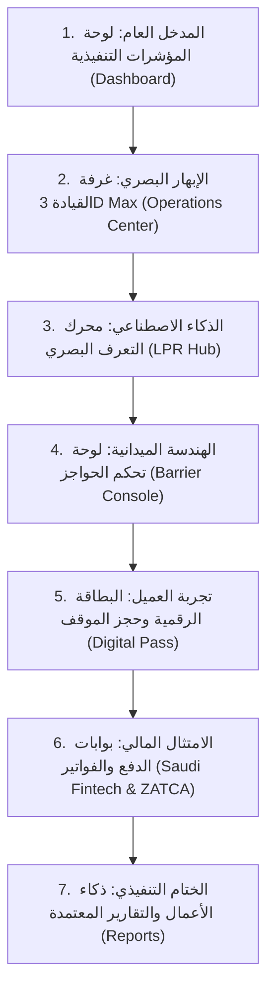

# 🏛️ الدليل الشامل لمنظومة المواقف الذكية المتقدمة — العرض التقديمي التنفيذي
## Kayan Smart Parking System — Comprehensive Presentation & Product Guide

> **وثيقة العرض والتقديم الرسمية (Executive Presentation Master README)**  
> تم إعداد هذا الدليل لتقديم وشرح كافة شاشات ووحدات منظومة المواقف الذكية، وتوضيح القيمة التشغيلية والمالية والأمنية التي تقدمها كل شاشة، بما يمكّنك من تقديم عرض تقديمي (Presentation) استثنائي يبهر لجان التحكيم والعملاء والقيادات التنفيذية.

---

## 📑 فهرس المحتويات التنفيذي

1. [الرؤية العامة والقيمة الاستراتيجية للمنظومة](#1-الرؤية-العامة-والقيمة-الاستراتيجية-للمنظومة)
2. [المحور الأول: قمرة القيادة والتحكم والمراقبة اللحظية](#المحور-الأول-قمرة-القيادة-والتحكم-والمراقبة-اللحظية)
3. [المحور الثاني: إنترنت الأشياء والذكاء الاصطناعي والمعدات الميدانية](#المحور-الثاني-إنترنت-الأشياء-والذكاء-الاصطناعي-والمعدات-الميدانية)
4. [المحور الثالث: تجربة السكان، المشتركين، والبطاقات الرقمية](#المحور-الثالث-تجربة-السكان-المشتركين-والبطاقات-الرقمية)
5. [المحور الرابع: التقنية المالية (Fintech)، الفوترة والامتثال السعودي](#المحور-الرابع-التقنية-المالية-fintech-الفوترة-والامتثال-السعودي)
6. [المحور الخامس: الحوكمة، ذكاء الأعمال والتقارير المتقدمة](#المحور-الخامس-الحوكمة-ذكاء-الأعمال-والتقارير-المتقدمة)
7. [أفضل سيناريو موصى به للعرض التقديمي (Demo Presentation Flow)](#7-أفضل-سيناريو-موصى-به-للعرض-التقديمي-demo-presentation-flow)

---

## 1. الرؤية العامة والقيمة الاستراتيجية للمنظومة

تعتبر المنظومة منصة وطنية ذكية متكاملة لإدارة المواقف الكبرى والمجمعات السكنية والتجارية والمباني الحكومية متعددة الطوابق، تم بناؤها وفق أعلى المعايير المعمارية والرقمية:
* **التوافق التام مع متطلبات المملكة العربية السعودية**: ربط مباشر مع بوابات الدفع المعتمدة (مدى، سداد، Apple Pay)، الفوترة الإلكترونية للمرحلة الثانية لهيئة الزكاة والضريبة والجمارك (ZATCA Phase 2)، ومعايير الأمن السيبراني للبنك المركزي السعودي (SAMA).
* **معمارية ثلاثية الأبعاد تفاعلية (3D Max Architecture)**: تمثيل واقعي ومجسم للمبنى وأدواره ومواقفه وشواحن السيارات الكهربائية.
* **الذكاء الاصطناعي البصري (Neural Vision LPR)**: دقة قراءة تتجاوز 99.4% للوحات السعودية بكافة فئاتها، مع زمن معالجة أقل من 68 ميلي ثانية.
* **الأتمتة الميكانيكية الفائقة**: زمن فتح للحواجز الهيدروليكية والسيرفو يصل إلى 0.4 ثانية.

---

## المحور الأول: قمرة القيادة والتحكم والمراقبة اللحظية

---

### 1. غرفة القيادة والتحكم الميدانية ثلاثية الأبعاد (3D Max Cockpit & Operations Center)
* **المسار في المنظومة**: `/operations` أو `/admin/operations-center`
* **الهدف الاستراتيجي**: منح إدارة العمليات رؤية بصرية مجسمة شاملة للمبنى وكافة مرافقه في شاشة بانورامية واحدة تحاكي غرف العمليات التكتيكية.
* **ماذا تفعل الصفحة عملياً؟**:
  1. **المجسم المعماري للمبنى (3D Building View)**: استعراض مبنى المواقف ثلاثي الأبعاد بكامل طبقاته (P0 الأرضي، P1 مواقف شواحن EV، P2 المواقف التنفيذية، و R سطح المبنى مع مهبط مروحيات VIP ذهبي متوهج).
  2. **مخطط الدور التفاعلي (3D Floor Layout)**: دخول تفاعلي إلى أي دور لعرض كل موقف (Slot) على حدة، مع خطوط السير والأسهم التوجيهية المضيئة.
  3. **التمييز البصري الفوري للحالات**:
     * **مواقف شاغرة**: إضاءة أرضية خضراء نيون مع مصباح LED سقفي أخضر يعلو الموقف.
     * **مواقف مشغولة**: ظهور سيارات مجسمة 3D واقعية (سيدان، دفع رباعي، رياضية) مع انعكاسات ضوئية ومصابيح ومصباح LED سقفي أحمر.
     * **شواحن السيارات الكهربائية (EV 3D Max)**: كابينات شحن مجسمة متوهجة باللون النيون، كابل شحن متصل بالسيارة، وتدفق حركي لجزيئات الطاقة مع شارة نسبة شحن البطارية (مثل: `🔋 84%⚡`).
  4. **المفتش اللحظي للموقف (Slot Inspector)**: عند النقر على أي موقف، تظهر بيانات الموقف، اللوحة السعودية الواقعية، اسم السائق، مدة الوقوف، وسرعة الشحن بالكيلوواط.
* **نقاط القوة في العرض التقديمي**:
  * استعراض التبديل السلس بين "المجسم المعماري للمبنى" و"مخطط الدور 3D".
  * النقر على موقف شاحن كهربائي لإظهار تقدم الشحن الحركي، وتوضيح أن المنظومة جاهزة لعصر التنقل الأخضر ورؤية 2030.

---

### 2. لوحة التحكم والقياسات التنفيذية (Executive Analytics Dashboard)
* **المسار في المنظومة**: `/dashboard`
* **الهدف الاستراتيجي**: تزويد أصحاب القرار بنظرة عليا فورية على الأداء العام، نسب الإشغال، الإيرادات اللحظية، والتدفقات المرورية.
* **ماذا تفعل الصفحة عملياً؟**:
  * عرض عدادات الإشغال الحية لكافة الأدوار ونسب التدوير اليومي للمواقف.
  * ملخص الإيرادات المحصلة اليومية وتوزيعها بين الدفع النقدي والإلكتروني والاشتراكات.
  * رصد فوري لعدد المركبات المتواجدة حالياً ومعدل مكوث المركبة في الموقف.
  * تنبيهات الذروة واقتراب الموقف من الامتلاء مع توجيه حركة السير الذكية.
* **نقاط القوة في العرض التقديمي**:
  * توضيح سرعة تحديث البيانات اللحظية (Real-Time Websockets عبر SignalR) بدون الحاجة لإعادة تحميل الصفحة.

---

### 3. شاشة المراقبة الميدانية اللحظية (Live Multi-Camera Monitor)
* **المسار في المنظومة**: `/live-monitor`
* **الهدف الاستراتيجي**: مراقبة شبكة الكاميرات الأمنية ومسارات الدخول والخروج والتعرف اللحظي على اللوحات على مدار الساعة.
* **ماذا تفعل الصفحة عملياً؟**:
  * شبكة شاشات مراقبة تفاعلية متزامنة لبوابات الشمال، الجنوب، الشرق، ومنصة كبار الشخصيات.
  * شريط عائم يعرض أحدث اللوحات الملتقطة فورياً بنموذج اللوحة السعودية الواقعي.
  * إبراز حالة التعرف (مطابق / مصرح / زائر / تنبيه أمني).
* **نقاط القوة في العرض التقديمي**:
  * محاكاة دخول سيارة ورؤية اللوحة تظهر مباشرة في الشريط الحي مع فتح البوابة فورياً.

---

### 4. مخططات الأدوار ومصفوفة الإشغال (Floor Maps & Occupancy Matrix)
* **المسار في المنظومة**: `/floor-maps` أو `/occupancy`
* **الهدف الاستراتيجي**: توفير خريطة تفاعلية مسطحة وهندسية للأدوار لتسهيل عمليات التوجيه الميداني وإدارة المساحات.
* **ماذا تفعل الصفحة عملياً؟**:
  * خريطة ثنائية وثلاثية الأبعاد تفاعلية لكل طابق مع تصنيف المواقف بالألوان.
  * إحصائيات سريعة: عدد المواقف المتبقية لذوي الاحتياجات الخاصة، كبار الشخصيات، والشواحن.
  * إمكانية حجز أو إغلاق موقف معين يدوياً للصيانة بنقرة واحدة.
* **نقاط القوة في العرض التقديمي**:
  * إبراز قدرة النظام على إدارة مجمعات عملاقة تضم آلاف المواقف بسلاسة مطلقة.

---

### 5. خدمة العثور على مركبتي (Find My Car & Visual Wayfinding)
* **المسار في المنظومة**: `/find-car` أو `/find-my-car`
* **الهدف الاستراتيجي**: إنهاء معاناة الزوار والسكان في البحث عن سياراتهم داخل المواقف الكبرى متعددة الأدوار.
* **ماذا تفعل الصفحة عملياً؟**:
  * إدخال رقم اللوحة السعودية أو الحروف للبحث الفوري عن موقع السيارة.
  * استخراج صورة حية للمركبة عند وقوفها ملتقطة بواسطة كاميرا الموقف المخصصة.
  * عرض الطابق، رقم الموقف، ورسم مسار توجيهي مرئي يرشد السائق خطوة بخطوة من موقعه الحالي حتى مكان سيارته.
* **نقاط القوة في العرض التقديمي**:
  * تجربة مبهرة للجمهور توضح مدى الرفاهية والتحول الرقمي الذي تقدمه المنشأة لروادها.

---

## المحور الثاني: إنترنت الأشياء والذكاء الاصطناعي والمعدات الميدانية

---

### 6. محرك التعرف الضوئي على اللوحات (LPR Optical Recognition Hub)
* **المسار في المنظومة**: `/lpr` أو `/admin/lpr`
* **الهدف الاستراتيجي**: قيادة وضبط خوارزميات الذكاء الاصطناعي والتعلم العميق لقراءة لوحات المركبات بكفاءة مطلقة.
* **ماذا تفعل الصفحة عملياً؟**:
  1. **المفتش البصري اللحظي (Optical HUD Inspector)**: شاشة رصد 4K Ultra-HD مع شعاع ليزري مسحي متحرك يرصد اللوحة.
  2. **رسم اللوحات السعودية الواقعية المعتمدة**: باستخدام المكون المطور `SaudiRealisticPlate` شاملاً الشعار والسيفين والنخلة والحروف والأرقام.
  3. **تفكيك نسب ثقة الذكاء الاصطناعي لكل حرف**: عرض نسبة دقة قراءة كل رمز بدقة متناهية (مثل `أ: 99.9%`، `ب: 99.8%`، `1: 99.7%`).
  4. **شرح مسار المعالجة العصبية (Deep Learning Pipeline)**: استعراض تفاعلي للمراحل الأربع:
     * *المرحلة 1*: كشف إطار اللوحة عبر YOLOv9 بدقة Sub-pixel.
     * *المرحلة 2*: تعديل زاوية الانحراف وإزالة الوهج بالأشعة تحت الحمراء IR.
     * *المرحلة 3*: تجزئة الحروف والتعرف البصري عبر Transformer OCR.
     * *المرحلة 4*: التدقيق البنيوي وإصدار أمر الفتح خلال 0.4 ثانية.
  5. **مختبر المحاكاة الفورية**: إمكانية كتابة أي لوحة واختيار البوابة لتنفيذ فحص ومطابقة حية أمام الجمهور.
* **نقاط القوة في العرض التقديمي**:
  * تجربة كتابة لوحة تجريبية وتفعيل الفتح التلقائي لإثبات فاعلية الذكاء الاصطناعي وسرعة الاستجابة (68 ميلي ثانية).

---

### 7. لوحة تحكم الحواجز الإلكترونية (Barrier Command & Telemetry Console)
* **المسار في المنظومة**: `/barriers` أو `/admin/barriers`
* **الهدف الاستراتيجي**: إدارة مصفوفة الحواجز الهيدروليكية والسيرفو الميدانية وقياس زوايا الرفع والاستجابة.
* **ماذا تفعل الصفحة عملياً؟**:
  1. **المجسم الحركي لذراع الحاجز (Animated Boom Arm Visualizer)**:
     * كابينة محرك سيرفو مع شاشة رقمية دقيقة لعرض الزاوية (من $0^\circ$ مغلق إلى $90^\circ$ مفتوح).
     * ذراع عاكس مخطط بخطوط الأمان وشريط إضاءة نيون ذكي يتغير لونه ديناميكياً (أخضر مفتوح، أزرق مغلق، برتقالي متحرك، أحمر عطل).
  2. **محاكاة الحساسات الميدانية**:
     * *مجس الملف الحثي الأرضي (Loop Detector)*: إضاءة نيون زرقاء على الأسفلت توضح وقوف السيارة، مع زر تفاعلي لمحاكاة وصول سيارة.
     * *حزمة الأمان الكهروضوئية الليزرية (Photocell Safety Beam)*: شعاع ليزري أخضر يقطع المسار، يتحول إلى أحمر مع حظر الإغلاق إذا وجد عائق لحماية السيارات من الصدم.
  3. **زر الطوارئ الشامل المضيء (Emergency Override All)**: فتح كافة البوابات فورياً لفرق الدفاع المدني والإسعاف مع نافذة توثيق أمني.
  4. **معايرة المحركات والزوايا**: شريط سحب دقيق (Slider) للمعايرة اليدوية لزاوية الرفع واختبار درجات حرارة المحركات.
* **نقاط القوة في العرض التقديمي**:
  * استعراض حركة الذراع الفيزيائية الانسيابية وإثبات أن النظام يراعي أعلى معايير السلامة العالمية لمنع اصطدام الذراع بأي سيارة.

---

### 8. إدارة البوابات والمسارات الذكية (Smart Gates & Lanes Manager)
* **المسار في المنظومة**: `/gates` أو `/admin/gates`
* **الهدف الاستراتيجي**: تكوين بوابات الموقع، تحديد اتجاهات المسارات (دخول / خروج / مشتركين / شحن)، وربطها بالأجهزة.
* **ماذا تفعل الصفحة عملياً؟**:
  * تعريف وتخصيص البوابات والممرات السريعة.
  * تحديد سياسات المرور لكل بوابة (مثلاً: بوابة الشمال مخصصة للسكان ومزودة برادار LPR مزدوج).
  * رصد حالة الاتصال اللحظية لكل بوابة عبر بروتوكولات OSDP و TCP/IP.
* **نقاط القوة في العرض التقديمي**:
  * توضيح مرونة المنظومة في التوسع وقدرتها على إدارة عشرات البوابات المتفرقة مركزياً.

---

### 9. شبكة كاميرات المراقبة والرصد 4K (Camera Network Center)
* **المسار في المنظومة**: `/cameras` أو `/admin/cameras`
* **الهدف الاستراتيجي**: متابعة الحالة التشغيلية والتقنية لكاميرات الرصد وكاميرات المراقبة البانورامية بالموقع.
* **ماذا تفعل الصفحة عملياً؟**:
  * عرض عناوين IP والشبكة الفرعية لكل كاميرا، معدل الإطارات (FPS)، ودقة التصوير (4K Ultra-HD).
  * فحص جاهزية مصابيح الأشعة تحت الحمراء الليلية (IR Illuminators).
  * التبديل السريع بين البث المباشر واختبار جودة البث.

---

### 10. مركز شواحن المركبات الكهربائية (EV Superchargers Hub)
* **المسار في المنظومة**: `/ev`
* **الهدف الاستراتيجي**: إدارة البنية التحتية لشحن السيارات الكهربائية ودعم التحول نحو الطاقة النظيفة.
* **ماذا تفعل الصفحة عملياً؟**:
  * مراقبة محطات الشحن فائق السرعة (150kW - 350kW DC Fast).
  * رصد فوري لحالة كل شاحن: (شاغر / قيد الشحن / مكتمل الشحن / قيد الصيانة).
  * احتساب الطاقة المستهلكة بالكيلوواط/ساعة وتكلفة الشحن وإضافتها تلقائياً إلى فاتورة الموقف.
* **نقاط القوة في العرض التقديمي**:
  * التأكيد على أن المنظومة لا تكتفي بإدارة ركن السيارات بل تدير منظومة الطاقة والتنقل الكهربائي الذكي.

---

### 11. نظام الإنذارات والأمن الميداني (Alarms & Security Center)
* **المسار في المنظومة**: `/alarms`
* **الهدف الاستراتيجي**: رصد وتتبع أي خروقات أمنية أو تجاوزات أو أعطال فنية فور حدوثها ومعالجتها فورياً.
* **ماذا تفعل الصفحة عملياً؟**:
  * إنذارات محاولات الدخول بلوحات غير مصرحة أو مدرجة بالقائمة السوداء.
  * إنذارات الوقوف الخاطئ أو احتلال مواقف ذوي الاحتياجات الخاصة أو مواقف الإخلاء.
  * توثيق إجراءات المشغلين (إقرار بالاستلام / معالجة البلاغ / توثيق التقرير الأمني).

---

## المحور الثالث: تجربة السكان، المشتركين، والبطاقات الرقمية

---

### 12. بطاقة العضوية الرقمية وتصاريح المرور الهولوجرافية (Digital Pass Card & QR)
* **المسار في المنظومة**: `/digital-card` أو `/pass`
* **الهدف الاستراتيجي**: إلغاء التذاكر الورقية واستبدالها ببطاقات ذكية هولوجرافية متطورة تدعم NFC والباركود المشفر.
* **ماذا تفعل الصفحة عملياً؟**:
  1. **البطاقة الرقمية الهولوجرافية ثلاثية الأبعاد**:
     * تصميم فاخر متلألئ يحمل شعار المنشأة، هوية المشترك، رقم اللوحة السعودية، وشريحة NFC الذكية.
     * باركود QR أمني مشفر ومتحرك لمنع التزوير أو إعادة الاستخدام.
  2. **حجز واختيار الموقف التفاعلي (Interactive Slot Selector)**:
     * إمكانية اختيار الموقف بدقة عبر مخطط الأدوار (P0 إلى R) مع إظهار المواقف الشاغرة بالأخضر والمحجوزة بالأحمر وشواحن EV.
  3. **توليد دعوة وتصريح ضيف متكامل**:
     * إضافة بيانات الزائر، رقم لوحته، نوع المركبة، وتاريخ الزيارة.
     * **توليد تصريح قابل للتحميل (PNG / PDF) ومشاركته فورياً عبر واتساب (WhatsApp)** مع تفاصيل الموقف المحجوز وتعليمات الوصول.
* **نقاط القوة في العرض التقديمي**:
  * استعراض بطاقة العضوية بتأثيراتها البصرية الهولوجرافية، وإرسال دعوة تجريبية للضيف وتأكيد سهولة مشاركتها.

---

### 13. إدارة الاشتراكات وباقات الموقف (Subscriptions & Pricing Tiers)
* **المسار في المنظومة**: `/subscriptions`
* **الهدف الاستراتيجي**: إدارة خطط التسعير، باقات المشتركين (VIP، السكان، الموظفون)، والعوائد الدورية.
* **ماذا تفعل الصفحة عملياً؟**:
  * **إدارة كاملة للباقات (CRUD)**: إضافة باقة جديدة، تعديل الأسعار، ومسح الباقات غير النشطة.
  * تحديد صلاحيات كل باقة (عدد المركبات المسموحة، الساعات، الوصول لمواقف VIP، شحن EV مجاني).
  * دليل المشتركين الفعال ومتابعة تواريخ التجديد والانتهاء والإشعارات التلقائية.
* **نقاط القوة في العرض التقديمي**:
  * توضيح قدرة المنشأة على توليد تدفقات مالية مستقرة ومتكررة عبر إدارة الاشتراكات بمرونة فائقة.

---

### 14. مركباتي المسجلة واللوحات المعتمدة (My Registered Vehicles)
* **المسار في المنظومة**: `/vehicles`
* **الهدف الاستراتيجي**: تمكين المستخدمين والمقيمين من إدارة مركباتهم المصرح لها بالدخول الذاتي.
* **ماذا تفعل الصفحة عملياً؟**:
  * استعراض سيارات المستخدم مع تجسيد كامل للوحاتها السعودية الرسمية.
  * إضافة سيارة جديدة مع التحقق التلقائي من صحة أرقام وحروف اللوحة.
  * ربط كل مركبة بالموقف المخصص لها أو باقة الاشتراك السارية.

---

### 15. نظام دعوات الضيوف وحجز المواقف المسبق (Guest Invites & Slot Booking)
* **المسار في المنظومة**: `/guest-invites` أو `/reservations`
* **الهدف الاستراتيجي**: منح المقيمين والشركات القدرة على استضافة زوارهم بأسلوب راقٍ دون انتظار عند البوابات.
* **ماذا تفعل الصفحة عملياً؟**:
  * إنشاء تصاريح زيارة مجدولة بالوقت والتاريخ.
  * حجز موقف محدد مسبقاً للزائر لضمان توفر المكان عند وصوله.
  * إشعار المضيف لحظة وصول ضيفه وعبوره من البوابة.

---

### 16. رابط تصريح الضيف العام السريع (Public Guest Pass)
* **المسار في المنظومة**: `/guest-pass` أو `/invite`
* **الهدف الاستراتيجي**: صفحة عامة وسريعة تفتح على هاتف الضيف عند النقر على رابط الدعوة بدون الحاجة لتسجيل دخول أو تثبيت تطبيق.
* **ماذا تفعل الصفحة عملياً؟**:
  * عرض بطاقة تصريح الدخول مع رمز QR للدخول السريع من البوابة.
  * عرض خريطة الموقع ورقم الموقف المخصص للضيف وإرشادات الملاحة.

---

## المحور الرابع: التقنية المالية (Fintech)، الفوترة والامتثال السعودي

---

### 17. بوابات الدفع الإلكتروني والربط البنكي السعودي (Saudi Payments & SAMA Fintech)
* **المسار في المنظومة**: `/saudi-payments` أو `/admin/saudi-payments`
* **الهدف الاستراتيجي**: إدارة منظومة الدفع الرقمي والربط المالي مع البنوك وشبكات المدفوعات الوطنية بالمملكة.
* **ماذا تفعل الصفحة عملياً؟**:
  1. **لوحة تحكم بوابات الدفع الوطنية (Full CRUD)**:
     * إدارة بوابة **مدى (Mada)**، محفظة **Apple Pay**، **STC Pay**، وبطاقات الائتمان (Visa / Mastercard).
     * إمكانية إضافة بوابة جديدة، تعديل الرسوم وعناوين الـ API، وحذف أو تعطيل أي بوابة بنقرة واحدة.
  2. **فحص الاتصال والمصافحة اللحظية (Live Handshake & Ping)**:
     * اختبار سرعة الاتصال بالبنوك بالملي ثانية وتأكيد جاهزية نقطة البيع POS.
  3. **الامتثال التام للبنك المركزي السعودي (SAMA)**:
     * تشفير عالي المستوى متوافق مع معايير PCI-DSS لضمان أقصى درجات الأمان المالي.
* **نقاط القوة في العرض التقديمي**:
  * تجربة إجراء "فحص اتصال بنكي مباشر" يوضح للمشاهدين أن المنظومة متصلة بالفعل بشبكة المدفوعات السعودية بكفاءة 100%.

---

### 18. محفظة الرصيد الرقمية الذكية (Digital Wallet & Auto-Topup)
* **المسار في المنظومة**: `/wallet`
* **الهدف الاستراتيجي**: توفير تجربة دفع سلسة وفورية للسكان والمشتركين عبر الخصم التلقائي عند الخروج.
* **ماذا تفعل الصفحة عملياً؟**:
  * رصيد المحفظة المتاح مع خيارات الشحن السريع عبر مدى أو Apple Pay.
  * تفعيل ميزة **الخصم التلقائي الذكي (Auto-Deduct)**: يخرج السائق من الموقف لترفع البوابة فورياً ويتم خصم الرسوم من المحفظة دون توقف.
  * سجل عمليات الشحن والخصم الموثقة رقمياً.
* **نقاط القوة في العرض التقديمي**:
  * إبراز مفهوم "المرور بدون احتكاك" (Frictionless Parking) الذي يوفر وقت السائق ويمنع التكدس عند بوابات الخروج.

---

### 19. سجل المدفوعات والعمليات المالية (Payments Center)
* **المسار في المنظومة**: `/payments` أو `/pay`
* **الهدف الاستراتيجي**: التدقيق المحاسبي الشامل لكافة عمليات التحصيل والمردودات والعمليات المكتملة.
* **ماذا تفعل الصفحة عملياً؟**:
  * جدول مالي متطور مع خيارات البحث والتصفية بحسب طريقة الدفع، البوابة، وتاريخ المعاملة.
  * إمكانية استعراض تفاصيل المعاملة المصرفية ورقم المرجع البنكي (RRN).
  * خيار إعادة المحاولة أو استرداد المبالغ في الحالات الاستثنائية.

---

### 20. الفواتير الضريبية المعتمدة (ZATCA Tax Invoices Center)
* **المسار في المنظومة**: `/invoices` أو `/receipts`
* **الهدف الاستراتيجي**: الامتثال لمتطلبات هيئة الزكاة والضريبة والجمارك للفوترة الإلكترونية (المرحلة الثانية).
* **ماذا تفعل الصفحة عملياً؟**:
  * إصدار فواتير ضريبية مبسطة تتضمن الرمز المشفر (Cryptographic Stamp) وباركود الاستجابة السريعة المشفر (TLV Base64 QR).
  * حساب تلقائي لضريبة القيمة المضافة 15% مع توضيح المبلغ الخاضع للضريبة.
  * إمكانية طباعة أو تحميل الفاتورة الضريبية الرسمية لتقديمها للأغراض المحاسبية.
* **نقاط القوة في العرض التقديمي**:
  * فحص الباركود الخاص بالفاتورة بكاميرا الهاتف لإثبات التوافق مع متطلبات ZATCA الرسمية.

---

### 21. مراقبة فترات السماح والمخالفات اللحظية (Grace Period Monitor)
* **المسار في المنظومة**: `/grace-period`
* **الهدف الاستراتيجي**: إدارة فترات السماح المجانية الممنوحة للزوار (مثلاً: 15 دقيقة) ورصد وتوثيق المخالفات آلياً.
* **ماذا تفعل الصفحة عملياً؟**:
  * **عداد تنازلي رقمي حي (Live Countdown Timer)** يوضح الدقائق والثواني المتبقية لكل مركبة قبل بدء احتساب الرسوم أو المخالفة.
  * تصنيف فوري للحالات: (داخل فترة السماح 🟢 / أوشكت على الانتهاء 🟡 / تجاوزت المدة 🔴).
  * سجل المخالفات التلقائي للمركبات المتجاوزة مع إمكانية تمديد فترة السماح استثنائياً بقرار من المشرف.
* **نقاط القوة في العرض التقديمي**:
  * توضيح كيفية حماية إيرادات المنشأة ومنع التلاعب أو الوقوف العشوائي في المسارات السريعة.

---

### 22. جلسات ومسارات الوقوف اللحظية (Parking Sessions Timeline)
* **المسار في المنظومة**: `/parking-sessions` أو `/session`
* **الهدف الاستراتيجي**: تتبع رحلة كل مركبة من لحظة الدخول حتى الخروج عبر مخطط زمني تفاعلي.
* **ماذا تفعل الصفحة عملياً؟**:
  * مسار زمني يوضح مراحل الجلسة: (الدخول والتقاط اللوحة -> ركن السيارة في الموقف -> سداد الرسوم -> الخروج وتأمين المسار).
  * حساب دقيق للمدة المستغرقة والتكلفة الإجمالية وحالة الدفع.

---

## المحور الخامس: الحوكمة، ذكاء الأعمال والتقارير المتقدمة

---

### 23. مركز التقارير والإحصائيات التحليلية (Business Intelligence & Reports)
* **المسار في المنظومة**: `/reports` أو `/admin/reports`
* **الهدف الاستراتيجي**: تزويد الإدارة العليا بالرؤى والبيانات الاستراتيجية لاتخاذ قرارات التوسع وتحسين الإيرادات.
* **ماذا تفعل الصفحة عملياً؟**:
  1. **مخطط الإيرادات الانسيابي الأسبوعي (Spline Area Chart)**: رسم بياني انسيابي متوهج يربط الإيرادات اليومية بحركات الدخول والخروج مع بطاقات توضيحية حية عند التمرير بالماوس.
  2. **مخطط ساعات الذروة اليومية (Hourly Peak Density)**: توزيع كثافة الحركة من 6:00 صباحاً حتى 12:00 ليلاً مع تمييز ساعات الذروة باللون البرتقالي.
  3. **أربعة تبويبات تحليلية شاملة**:
     * *التبويب 1*: الإيرادات والتدفقات العامة وضريبة القيمة المضافة.
     * *التبويب 2*: تصنيف سلوك المستخدمين (سكان 48%، زوار 34%، دعوات 18%)، وفترات البقاء ومتوسط الفاتورة.
     * *التبويب 3*: أداء قنوات الدفع والتسويات البنكية السعودية (مدى 58%، Apple Pay 24%، STC Pay 12%).
     * *التبويب 4*: كفاءة الكاميرات والحساسات ودقة الرصد (99.4%) وسرعة رفع الحواجز (0.4 ثانية).
  4. **تصدير تقرير معتمد**: تحميل تقارير رسمية بصيغة PDF عالية الدقة أو جداول Excel جاهزة للتحليل المالي.
* **نقاط القوة في العرض التقديمي**:
  * الانتقال بين التبويبات التفاعلية واستعراض الرسوم البيانية المتوهجة لإثبات نضج المنظومة وقوة تقاريرها التنفيذية.

---

### 24. إدارة المستخدمين وصلاحيات المشغلين (Users & Access Management)
* **المسار في المنظومة**: `/users` أو `/admin/users`
* **الهدف الاستراتيجي**: إدارة حسابات المشرفين، موظفي الأمن، ومديري الحسابات وتوزيع الأدوار الوظيفية.
* **ماذا تفعل الصفحة عملياً؟**:
  * إضافة وتعديل حسابات المشغلين مع تفعيل المصادقة الثنائية (2FA).
  * تعيين الصلاحيات المحددة لكل موظف وفق مصفوفة الصلاحيات المعتمدة.

---

### 25. الأدوار والصلاحيات المتقدمة (Roles & Permissions Matrix)
* **المسار في المنظومة**: `/roles`
* **الهدف الاستراتيجي**: تطبيق سياسات الحوكمة ومنح الصلاحيات الصارمة (RBAC) لحماية أمن النظام.
* **ماذا تفعل الصفحة عملياً؟**:
  * تحديد صلاحيات الوصول الدقيقة (مشرف نظام، مسؤول مالي، مراقب أمني، مشغل بوابات).
  * قفل أو تقييد العمليات الحساسة (مثل فتح الطوارئ أو تعديل الرسوم) برتب عليا فقط.

---

### 26. سجل التدقيق والرقابة الجنائية (Audit Logs & Security Trails)
* **المسار في المنظومة**: `/audit-logs`
* **الهدف الاستراتيجي**: توثيق كل حركة أو نقرة أو تعديل في النظام لضمان النزاهة والمساءلة الكاملة.
* **ماذا تفعل الصفحة عملياً؟**:
  * سجل غير قابل للتعديل يوثق اسم المستخدم، عنوان IP، توقيت العملية، والإجراء المنفذ (مثل: أمر فتح يدوي للحاجز رقم 03).
  * خيارات فلترة متقدمة للتحقيق في الحوادث الأمنية والتشغيلية.

---

### 27. صحة وتكامل خوادم المنظومة (System Health & Infrastructure)
* **المسار في المنظومة**: `/system-health`
* **الهدف الاستراتيجي**: مراقبة سلامة الخوادم، قاعدة البيانات، خدمات SignalR، والشبكة الميدانية.
* **ماذا تفعل الصفحة عملياً؟**:
  * قياس معدل استهلاك الذاكرة والمعالج وزمن استجابة الـ API.
  * فحص حالة ربط أجهزة الميدان والتأكد من عدم وجود أي انقطاع بالشبكة.

---

### 28. مركز الإشعارات والتنبيهات المباشرة (Notifications Center)
* **المسار في المنظومة**: `/notifications`
* **الهدف الاستراتيجي**: قناة تواصل لحظية تنقل التنبيهات التشغيلية والمالية والأمنية للمشغلين والمستخدمين فور حدوثها.

---

### 29. الملف الشخصي وإعدادات المشغل (Profile & Settings)
* **المسار في المنظومة**: `/profile` و `/settings`
* **الهدف الاستراتيجي**: تخصيص تجربة الاستخدام، لغات النظام، والتبديل بين النمط الليلي (Dark Mode) والنمط النهاري الكريستالي الفاخر.

---

## 7. أفضل سيناريو موصى به للعرض التقديمي (Demo Presentation Flow)

لتحقيق أقصى درجات الإبهار والنجاح في البريزنتيشن أمام أصحاب القرار، نوصي باتباع الخطوات التالية بالترتيب:

### تفاصيل خطة العرض المقترحة (خطوة بخطوة):

1. **الخطوة الأولى (دقيقة 1 - 2): لوحة المؤشرات العامة (`/dashboard`)**:
   * *ما تقوله*: "نبدأ معكم من لوحة المؤشرات التنفيذية التي تمنح الإدارة العليا ملخصاً حياً للإيرادات وتدفقات المركبات ونسب الإشغال في الوقت الحقيقي."
2. **الخطوة الثانية (دقيقة 3 - 5): قمرة العمليات ثلاثية الأبعاد 3D Max (`/operations`)**:
   * *ما تفعله*: فتح المجسم المعماري للمبنى، استعراض الأدوار، الدخول إلى الدور الأول P1، إظهار المواقف الشاغرة والمشغولة والسيارات المجسمة، ثم النقر على شاحن سيارة كهربائية لاستعراض تدفق الطاقة ونسبة الشحن الحركية.
   * *ما تقوله*: "هنا نرى التجسيم ثلاثي الأبعاد المتطور 3D Max، حيث نتحكم بكل طابق وموقف وشاحن كهربائي بدقة فائقة."
3. **الخطوة الثالثة (دقيقة 6 - 7): محرك قراءة اللوحات LPR (`/lpr`)**:
   * *ما تفعله*: استعراض نموذج اللوحة السعودية الواقعي وتفكيك نسب ثقة الأحرف، ثم النقر على "محاكاة رصد لوحة جديدة" وكتابة لوحة وتفعيل المسح الفوري.
   * *ما تقوله*: "محركنا البصري المعتمد يعتمد على التعلم العميق ويقرأ اللوحات السعودية في 68 ميلي ثانية بدقة 99.4%."
4. **الخطوة الرابعة (دقيقة 8 - 9): لوحة تحكم الحواجز (`/barriers`)**:
   * *ما تفعله*: النقر على "رفع وفتح الحاجز" لرؤية الذراع يتحرك بزاوية $90^\circ$ بسلاسة، ثم النقر على "محاكاة مركبة" لرؤية وميض حساس الحث الأرضي وشعاع الليزر الكهروضوئي.
   * *ما تقوله*: "أذرع الحواجز الهيدروليكية تفتح في 0.4 ثانية ومحمية بحزم ليزر كهروضوئية تمنع أي اصطدام بالمركبات."
5. **الخطوة الخامسة (دقيقة 10 - 11): البطاقة الرقمية وحجز الموقف (`/digital-card`)**:
   * *ما تفعله*: استعراض بطاقة العضوية الهولوجرافية اللامعة، فتح منتقي المواقف وحجز موقف شاغر وتوليد تصريح زيارة ضيف جاهز للتحميل والإرسال عبر واتساب.
   * *ما تقوله*: "استبدلنا التذاكر الورقية ببطاقات ذكية هولوجرافية وتصاريح رقمية ترسل للضيوف في ثوانٍ عبر واتساب."
6. **الخطوة السادسة (دقيقة 12 - 13): المدفوعات والامتثال السعودي (`/saudi-payments` و `/invoices`)**:
   * *ما تفعله*: إظهار بوابات مدى و Apple Pay و STC Pay، إجراء فحص اتصال بنكي مباشر (Ping)، ثم فتح فاتورة ضريبية وإظهار باركود ZATCA المعتمد.
   * *ما تقوله*: "المنظومة متوافقة 100% مع البنك المركزي السعودي SAMA وهيئة الزكاة والضريبة والجمارك للمرحلة الثانية."
7. **الخطوة السابعة (دقيقة 14 - 15): مركز التقارير والختام (`/reports`)**:
   * *ما تفعله*: استعراض المخطط الانسيابي الأسبوعي، ساعات الذروة، تصنيف المستخدمين، ونقر زر "تصدير تقرير معتمد PDF / Excel".
   * *ما تقوله*: "وأخيراً، نوفر للإدارة تقارير ذكاء أعمال شاملة تدعم اتخاذ القرارات الاستثمارية، وقابلة للتصدير الفوري بنقرة واحدة."

---

> **خلاصة القول**:  
> تمثل هذه المنظومة نموذجاً فخراً للتقنية الذكية المتكاملة التي تجمع بين جمال التصميم، فصاحة اللغة، دقة الهندسة، والامتثال للأنظمة والمعايير السعودية.
